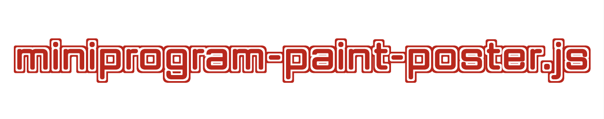

<p align="center">
    <a href="#" target="_blank" rel="noopener noreferrer">
        
    </a>
</p>
<p align="center">miniprogram-paint-poster.js 一个Taro小程序绘制海报图 <b>18.4kB</b> 的解决方案，拥有强大绘图的 API</p>
<br>
<!-- <p align="center">
    <a href="https://unpkg.com/dayjs/dist/dayjs.min.js"></a>
    <a href="https://www.npmjs.com/package/dayjs"></a>
    <a href="https://travis-ci.org/xx45/dayjs"></a>
    <a href="https://codecov.io/gh/xx45/dayjs"></a>
    <a href="https://github.com/xx45/dayjs/blob/master/LICENSE"></a>
</p> -->

> miniprogram-paint-poster.js 是一个解决小程序端绘制海报图的vanvas库,基于promise,支持自定义canvas背景颜色,图片,支持绘制多种格式文字,多种样式图片,多种图形.你可以随意组合这几种元素构根据业务需要构建出复杂的canvas海报图.可以满足90%以上的业务需要了!


---
- [安装](#安装)
- [开始](#开始)
    - [示例图片](#示例图片)
- [API](#api)
  - [初始化](#初始化)
  - [绘制cavans背景色](#绘制cavans背景色)
  - [绘制图片](#绘制图片)
    - [绘制简单矩形图片](#绘制简单矩形图片)
    - [绘制圆形裁切图片](#绘制圆形裁切图片)
    - [绘制圆形带边框裁切图片](#绘制圆形带边框裁切图片)
    - [绘制圆角矩形图片](#绘制圆角矩形图片)
  - [绘制形状](#绘制形状)
    - [绘制圆形形状](#绘制圆形形状)
    - [绘制矩形形状](#绘制矩形形状)
  - [绘制文字](#绘制文字)
    - [绘制单行文字](#绘制单行文字)
    - [绘制多行自动折行文字](#绘制多行自动折行文字)
    - [绘制带环形边框文字居中](#绘制带环形边框文字居中)
    - [绘制带环形形状文字居中](#绘制带环形形状文字居中)
  - [预览绘制的海报图](#预览绘制的海报图)
  - [保存海报图到本地](#保存海报图到本地)
- [开源协议](#开源协议)

---

## 安装

可以有如下多种方法安装使用 miniprogram-paint-poster.js:

- NPM:
```console
npm install miniprogram-paint-poster --save
```

- Yarn:
```console
yarn add miniprogram-paint-poster
```


## 开始
`miniprogram-paint-poster`并没有内置canvas,引用的canvas是开发者在页面上canvas,给予开发者更大的灵活性.以Taor(react)为例:
```js
import React, {useEffect, useState} from "react";
import Taro,{useRouter,useShareAppMessage} from "@tarojs/taro";

// 导入依赖
import FreePoster from 'miniprogram-paint-poster'

const sharePage =  () => {

    // canvas样式 
    // 这里的宽高影响的实际的canvas宽高,虽然默认的宽高是750/1334
    const canvasStyle = {
        position: "absolute",
        left: 0,
        bottom: 0,
        width: "750PX",
        height: "750PX",
        transform: "translate3d(-9999rpx, 0, 0)"
    }

    const savePosterToAlbumText = async () =>{
        const {title,gender,category_title,birthday,desc,id_card,logo} = petInfo;
        const birthdayObj = birthday.split("-");
        const labelColor='#7387FF';
        const labelPosX = 60;
        const valueColor='#333333';
        const fontsize=26;
        const textPosY = (y) => y+37-150;

        // 初始化FreePoster构造函数
        const freePoster = new FreePoster({
            debug:true,
            globalEnv:Taro,
        });

        // 自定义canvas背景颜色
        freePoster.setCanvasBackground("#fff");

        // 绘制图片因为要请求图片涉及异步操作,需要使用await
        await freePoster.paintImg({ // canvas背景图
            width:750,
            height:750,
            x:0,
            y:0,
            src:'https://qiniu.ling7.net/image/petWorld/certificate_bg_share%402x.png?imageView2/1/w/750/h/750'
        });
        await freePoster.paintImg({
            width:690,
            height:400,
            x:30,
            y:30,
            src:'https://qiniu.ling7.net/image/petWorld/certificate_bg%402x.png'
        });
        await freePoster.paintImg({ // 宠物相片
            width:190,
            height:232,
            x:500,
            y:208-150,
            src:`https://qiniu.ling7.net/Fvt4eojNgtmY_OeeegJ4I9G26kmt?imageView2/1/w/190/h/232?imageView2/1/w/190/h/232|roundPic/radius/16`
        })
        // 绘制带边框的圆形裁切二维码
        await freePoster.drawPaddingCircleImg({ // 二维码
            width:180,
            height:180,
            padding:6,
            backgroundColor:'#FFF4CC',
            x:528,
            y:517,
            src:`https://qiniu.ling7.net/image/petWorld/page-home.png?roundPic/radius/16`
        })
        // 绘制单行文字
        freePoster.paintOneLineText({  // 姓名label
            txt: '姓名',
            font:'STHeiti',
            fontSize: fontsize,
            color:labelColor,
            x:labelPosX,
            y:textPosY(210) // 加上文字高度 37px
        })
        // 绘制环形图背景文字居中
        freePoster.paintCircularText({
            txt:'奇葩奶牛猫',
            fontSize:fontsize,
            color:labelColor,
            x:100,
            y:textPosY(274), // 加上文字高度 37px
            circularH:100,
            circularW:300,
            circularColor: "#CDFF76",
            circularY: 600
        })
        // 绘制多行可自动折行文本
        freePoster.paintMultiLine({
            txt: '似虎能缘木，如驹不伏辕。但知空鼠穴，无意为鱼餐。薄荷时时醉，氍毹夜夜温。前生旧童子，伴我老山村。',
            font:'STHeiti',
            fontSize: fontsize,
            color:valueColor,
            oneLineTextNum:12,
            lineDistance:40,
            x:140,
            y:textPosY(402)
        })

        // 绘制带环形边框的居中文字
        freePoster.paintBorderCircularText({
            circularX:56,
            circularY:590,
            circularW:310,
            circularH:36,
            borderColor:'#C5CDFF',
            txt:'签发机构：宠世界小程序',
            fontSize:22,
            color:'#7487FE',
            x:0,
            y:0
        })

        // 保存海报图到本地
        await freePoster.savePosterToPhoto()

        // 预览海报图
        await freePoster.previewPoster()
  };

return(
    <View>

        <View onClick={savePosterToAlbumText}>测试保存到相册</View>


        <!-------自定义canvas元素----------->
        <Canvas canvas-id='posterCanvasId' style={canvasStyle} id='posterCanvasId'></Canvas>
        
    </View>
)

}
export default sharePage;
```

#### 示例图片


## API

### 初始化
new FreePoster(params)构造函数的默认字段:

| 字段 | 默认值 | 说明 |
| ------ | ------ | ----------- |
| globalEnv| window.wx     | canvasAPI能力提供对象(必须提供!)|
| quality |   1   | 海报图质量(0->1)|
| canvasId | 'posterCanvasId' | canvas默认id|
| debug    | false  | 是否开启调试信息,默认关闭 |

```js
// 初始化FreePoster构造函数
const freePoster = new FreePoster({
    debug:true,
    globalEnv:Taro,
});
```

### 绘制cavans背景色

```js
// 自定义canvas背景颜色
freePoster.setCanvasBackground("#fff");
```

### 绘制图片

#### 绘制简单矩形图片

```js
// 绘制图片因为要请求图片涉及异步操作,需要使用await
await freePoster.paintImg(imgInfo);

```

imginfo参数如下

| 字段   | 说明                         |
| ------ | ---------------------------- |
| x      | 相对canvas左上角的x坐标      |
| y      | 相对canvas左上角的y坐标      |
| width  | 宽度                         |
| height | 高度                         |
| src    | 图片地址（本地或者网络图片） |


#### 绘制圆形裁切图片

```js
// 绘制图片因为要请求图片涉及异步操作,需要使用await
await freePoster.paintCircleImage(imgInfo)
```
imginfo参数如下

| 字段            | 说明                         |
| --------------- | ---------------------------- |
| x               | 图片相对canvas左上角的x坐标  |
| y               | 图片相对canvas左上角的y坐标  |
| width           | 图片宽度                     |
| height          | 图片高度                     |
| src             | 图片地址（本地或者网络图片） |


#### 绘制圆形带边框裁切图片

```js
// 绘制图片因为要请求图片涉及异步操作,需要使用await
await freePoster.drawPaddingCircleImg(imgInfo)
```
imginfo参数如下

| 字段            | 说明                         |
| --------------- | ---------------------------- |
| x               | 图片相对canvas左上角的x坐标  |
| y               | 图片相对canvas左上角的y坐标  |
| width           | 图片宽度                     |
| height          | 图片高度                     |
| src             | 图片地址（本地或者网络图片） |
| padding         | 边框大小                     |
| backgroundColor | 边框颜色                     |


#### 绘制圆角矩形图片

```js
// 绘制图片因为要请求图片涉及异步操作,需要使用await
await freePoster.paintRadiusImage(imgInfo)
```
imginfo参数如下

| 字段   | 说明                         |
| ------ | ---------------------------- |
| x      | 图片相对canvas左上角的x坐标  |
| y      | 图片相对canvas左上角的y坐标  |
| width  | 图片宽度                     |
| height | 图片高度                     |
| src    | 图片地址（本地或者网络图片） |
| r      | 圆角所处圆的半径尺寸         |

### 绘制形状

#### 绘制圆形形状

```js
freePoster.paintCircleShape(shapeInfo<Object>)
```

shapeInfo参数如下

| 字段            | 说明                  |
| --------------- | --------------------- |
| x               | 圆形的外切矩形的x坐标 |
| y               | 圆形的外切矩形的y坐标 |
| width           | 圆形的外切矩形宽度    |
| height          | 圆形的外切矩形高度    |
| backgroundColor | 背景色                |

#### 绘制矩形形状

```js
freePoster.paintRectShape(shapeInfo<Object>)
```

shapeInfo参数如下

| 字段            | 说明                  |
| --------------- | --------------------- |
| x               | 圆形的外切矩形的x坐标 |
| y               | 圆形的外切矩形的y坐标 |
| width           | 圆形的外切矩形宽度    |
| height          | 圆形的外切矩形高度    |
| backgroundColor | 背景色                |


### 绘制文字

#### 绘制单行文字

```js
freePoster.paintOneLineText(textInfo<Object>)
```

textInfo的参数如下：

| 字段       | 说明                                                         |
| ---------- | ------------------------------------------------------------ |
| x          | 文字相对canvas左上角的x坐标                                  |
| y          | 文字相对canvas左上角的y坐标                                  |
| fontSize   | 文字字体大小                                                 |
| color      | 文本颜色                                                     |
| MaxTextNum | 最多多少文字，超过这个范围截取文字并且用。。。代替           |
| font       | 设置字体所有的属性，如果有front,则覆盖现有的字体大小，颜色。（font-style, font-variant, font-weight, font-size, line-height 和 font-family ） |
| txt        | 文本                                                         |
#### 绘制多行自动折行文字

```js
freePoster.paintMultiLine(textInfo<Object>)
```

textInfo的参数如下：

| 字段           | 说明                |
| -------------- | ------------------- |
| txt            | 文本                |
| x              | 文本第一行文字x坐标 |
| y              | 文本第一行文字y坐标 |
| fontSize       | 字体大小            |
| color          | 字体颜色            |
| lineDistance   | 行间距              |
| oneLineTextNum | 一行有几个文字      |

#### 绘制带环形边框文字居中

```js
freePoster.paintBorderCircularText(textInfo<Object>)
```

textInfo的参数如下：

| 字段        | 说明         |
| ----------- | ------------ |
| txt         | 文本         |
| fontSize    | 文字大小     |
| color       | 文本颜色     |
| borderColor | 边框颜色     |
| circularH   | 环形边框高度 |
| circularW   | 环形边框宽度 |
| circularX   | 环形x坐标    |
| circularY   | 环形y坐标    |

#### 绘制带环形形状文字居中

```js
freePoster.paintCircularText(textInfo<Object>)
```

textInfo的参数如下：

| 字段          | 说明         |
| ------------- | ------------ |
| txt           | 文本         |
| fontSize      | 文字大小     |
| color         | 文本颜色     |
| circularColor | 环形形状颜色 |
| circularH     | 环形边框高度 |
| circularW     | 环形边框宽度 |
| circularX     | 环形x坐标    |
| circularY     | 环形y坐标    |


### 预览绘制的海报图

```js
// 预览海报图
await freePoster.previewPoster()
```

### 保存海报图到本地
```js
// 保存海报图到本地
await freePoster.savePosterToPhoto()
```

---
## 开源协议

MIT